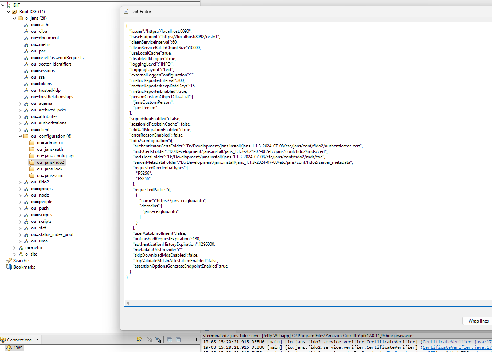
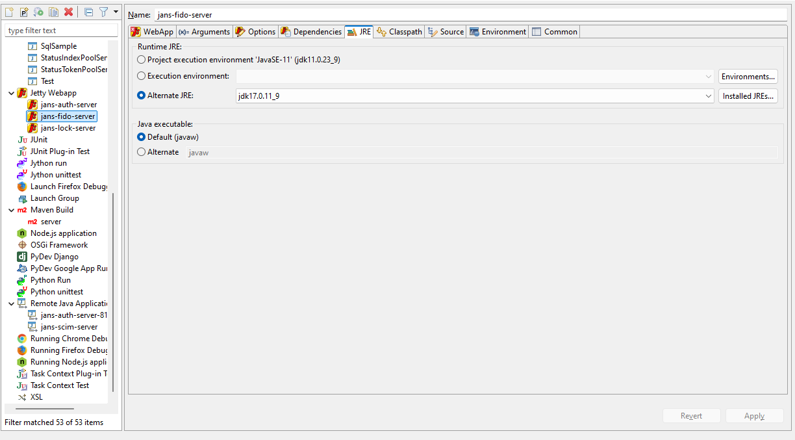
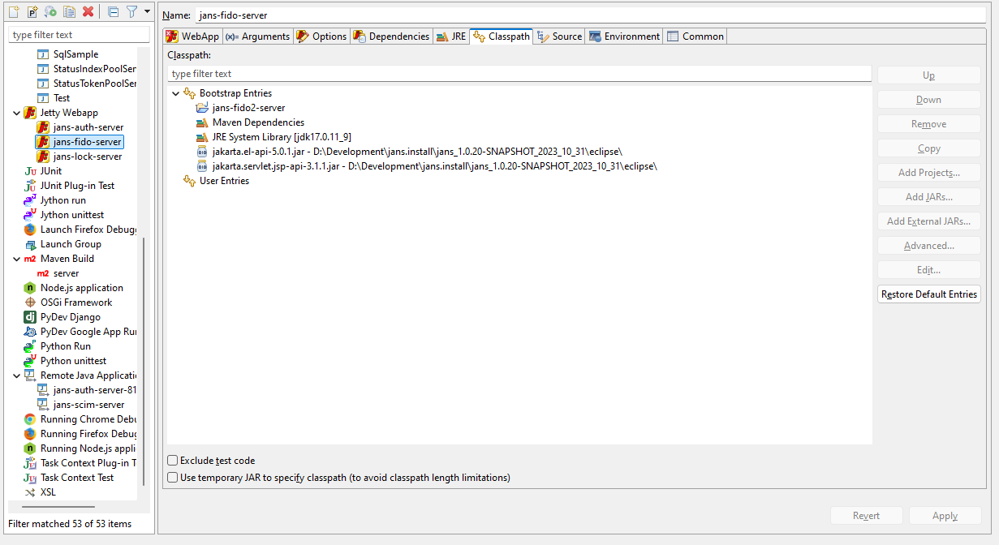
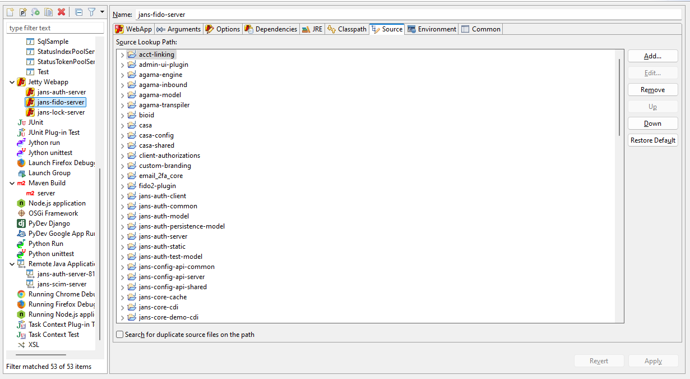
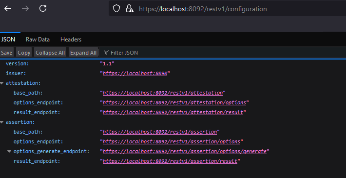

# Developing for Janssen Project

## Remote Debugging

Janssen Server modules run as Java processes. Hence, like any other Java process
the JVM running the module can be configured to open a debug port where a remote
debugger can be attached. The steps below will show how to configure 
`auth-server` module for remote debugging.

1. Pass the command-line options to the JVM

   On the Janssen Server host, open the service config file 
   `/etc/default/jans-auth` and add the following JVM parameters to as 
   `JAVA_OPTIONS`
    ```
    -Xrunjdwp:transport=dt_socket,server=y,suspend=n,address=6001
    ```
   This will open the port `6001` for the remote debugger. Any other port can 
   also be used based on availability.

2. Restart `jans-auth` services
    ```
    systemctl restart jans-auth.service
    ```

3. Check if the port is open and accessible from within the Janssen Server host
   Use the `jdb` tool from JDK to test if the JVM port has been opened
   ```
   ./<path-to-JDK>/bin/jdb -attach 6001
   ```
   if the port is open, it'll give you output like the below:
   ```
   Set uncaught java.lang.Throwable
   Set deferred uncaught java.lang.Throwable
   Initializing jdb ...
   >
   ```
   press `ctrl+c` to come out of it.

4. Ensure that the port is accessible from outside the host VM as well and 
   firewalls are configured accordingly

5. Connect to the remote port on the Janssen Server host from the developer 
   workstation. Use any IDE (Intellij, Eclipse,
   etc.) to create and run a remote debugging profile. Provide IP and debug 
   port of the Janssen Server host.

   For IntelliJIdea, create a debug configuration as below:

   

## Running Janssen Server Modules From An IDE

It is possible to run Janssen Server modules from an IDE like Eclipse or 
VSCode or IntelliJ. In this section, we are going to see steps required 
to run modules from Eclipse IDE. 

### Pre-requisite

A running instance of Janssen Server(with OpenDJ LDAP as datastore) will be 
required to complete the local
setup. You should be able to transfer/download files from this Janssen Server
to your local environment. This is due to modules requiring certain files and 
programs to be available on your local machine that are readily available on 
the Janssen Server instance.

### Runnng Fido2 Module

#### Data preparation

Get the following files and directories from Janssen Server instance to your 
local environment. Assuming the local directory under which you'll store these
artifacts is `D:\Developement\jans\jans_1.1.3-2024-07-08`,

From Janssen Server path `/etc/certs/*` and `/etc/jans/*` to local environment's
`D:\Developement\jans\jans_1.1.3-2024-07-08\etc\certs\` and 
`D:\Developement\jans\jans_1.1.3-2024-07-08\etc\jans\` respectively.

From Janssen Server path `/opt/jans/jans-setup/*` to local environment's
`D:\Developement\jans\jans_1.1.3-2024-07-08\jans-setup\`.

From Janssen Server path `/opt/jython-2.7.3/*` to local environment's
`D:\Developement\jans\jans_1.1.3-2024-07-08\jython-2.7.3\`.

From Janssen Server path `/opt/opendj/*` to local environment's
`D:\Developement\jans\jans_1.1.3-2024-07-08\opendj\`.

This should result in a directory structure like this:

```
  D:\Developement\jans\jans_1.1.3-2024-07-08
   |-etc
     |- certs\*
     |- jans\*
   |-jans-setup
   |-jython-2.7.3
   |-opendj
```

#### Eclipse plugins

Install next Eclipse plugins:

* Apache Directory Studio (select browser part only)
* Eclipse jetty 7.0.0

#### Run server locally

This section shows how to run Fido2 server, for example

1. Start OpenDJ from local folder.
2. Connect to OpenDJ with Apache DS plugin and update config



3. Configure new Jetty Webapp run configuration. Here are screenshots:







#### Expected result





## Run Integration Tests with a Janssen Server VM

In this guide, we will look at steps to run the Janssen integration test suite 
against an installed Janssen Server.

### Component Setup

Instructions in this guide can be used if Janssen Server is installed on a VM. 
Developers can use a virtualization software (like VMWare) or use LxD containers to create VM on developer workstation or use a remote cloud VM.


!!! note "OS platform for Developer Workstation"
    Steps in this guide are applicable to any OS platform a Developer workstation may have. Example commands given in this guide are for Ubuntu Linux based workstation.  

### Install Janssen Server

Install the Janssen server using one of the methods described in the
VM installation guide. Note the points below when
following installation instructions.

- Make a note
  of the `host name` that you assign to the Janssen server during the 
  installation. For this guide, the Janssen hostname would be `janssen.op.io`
- Choose to install with test data load. This can be achieved by using 
  the `-t` switch when invoking the setup script
  from installation instructions.

Use the [VM installation guide](../admin/install/vm-install/README.md) for the 
complete set of instructions.

Once the installation is complete, check if the `.well-known` end-points of the
Janssen server from the browser. A successful response will ascertain that the
The Janssen server running inside the local VM is healthy and also accessible 
from the developer's machine.

!!! Note
    Based on developer setup it may be necessary to add appropriate IP-HOST 
    mapping to the developer workstation. For instance, on a Linux-based 
    developer workstation, this means adding a mapping to `/etc/hosts` file. 
    Make sure that VM's IP is mapped to a FQDN like `janssen.op.io`. Refering 
    to VM with `localhost` or just IP will not work.

URI for OpenID configuration `.well-known` endpoint:

  ```
  https://janssen.op.io/jans-auth/.well-known/openid-configuration
  ```

The response received should be JSON formatted Janssen configuration details, 
similar to those below.

  ```
  {
  "request_parameter_supported" : true,
  "pushed_authorization_request_endpoint" : "https://janssen.op.io/jans-auth/restv1/par",
  "introspection_endpoint" : "https://janssen.op.io/jans-auth/restv1/introspection",
  "claims_parameter_supported" : false,
  "issuer" : "https://janssen.op.io",
  "userinfo_encryption_enc_values_supported" : [ "RSA1_5", "RSA-OAEP", "A128KW", "A256KW" ],
  "id_token_encryption_enc_values_supported" : [ "A128CBC+HS256", "A256CBC+HS512", "A128GCM", "A256GCM" ],
  "authorization_endpoint" : "https://janssen.op.io/jans-auth/restv1/authorize",
  "service_documentation" : "http://jans.org/docs",
  "authorization_encryption_alg_values_supported" : [ "RSA1_5", "RSA-OAEP", "A128KW", "A256KW" ],
  "id_generation_endpoint" : "https://janssen.op.io/jans-auth/restv1/id",
  "claims_supported" : [ "street_address", "country", "zoneinfo", "birthdate", "role", "gender", "user_name", "formatted", "phone_mobile_number", "preferred_username", "inum", "locale", "updated_at", "post_office_box", "nickname", "preferred_language", "email", "website", "email_verified", "profile", "locality", "room_number", "phone_number_verified", "given_name", "middle_name", "picture", "name", "phone_number", "postal_code", "region", "family_name", "jansAdminUIRole" ],
  "scope_to_claims_mapping" : [ {
    "user_name" : [ "user_name" ]
  }, {
    "https://jans.io/scim/users.write" : [ ]
  }, {
    "https://jans.io/scim/groups.read" : [ ]
  }, {
    "https://jans.io/scim/all-resources.search" : [ ]
  }, {
    "https://jans.io/scim/fido.write" : [ ]
  }, {
    "https://jans.io/scim/groups.write" : [ ]
  }, {
    "https://jans.io/scim/fido2.read" : [ ]
  }, {
    "https://jans.io/scim/fido.read" : [ ]
  }, {
    "https://jans.io/scim/fido2.write" : [ ]
    
  ```

### Setup The Certificates

To run the tests against the installed Janssen Server, the workstation JRE 
needs to have the appropriate
certificate installed. Update cacerts using the steps below:


- extract certificate for Janssen server with name `janssen.op.io`
  ```shell title="On Developer Workstation"
  openssl s_client -connect test.local.jans.io:443 2>&1 |sed -ne '/-BEGIN CERTIFICATE-/,/-END CERTIFICATE-/p' > /tmp/httpd.crt
  ```
  this command takes a few seconds to return.

- Update cacerts of your JRE which is being used by the code workspace. For example,  
  `/usr/lib/jvm/java-11-amazon-corretto`. When running the command below, it 
  will prompt for cert store password. Provide
  the correct password. The default password is `changeit`.
  ```
  keytool -import -alias janssen.op.io -keystore /usr/lib/jvm/java-11-amazon-corretto/lib/security/cacerts -file /tmp/httpd.crt
  ``` 

### Configure developer workspace

Now that we have Janssen Server running in a VM and it is accessible from the 
developer workstation as well, we will
create and configure the code base on the developer workspace to run integration
tests.

Get Janssen server code from [Janssen GitHub repository](https://github.com/JanssenProject/jans). Note the path to this location, we will refer to it as `source-base`.

Janssen Server is composed of multiple modules. For example `source-base/jans-auth-server`, `source-base/jans-link` etc. 

Each module has its own set of 
tests.
Below are the instructions for configuring each module for tests.

!!! info "What is a Profile directory?"
    - To run integration tests, the developer workspace needs to know details about he Janssen Server agaist which the tests are to be run. 
    - Janssen Server workspace holds this information in `source-base/module/sub-module/profiles` directory.
    - The `profiles` directory can contain one or more sub-directories, each representing a profile(i.e a target Janssen Server). These profile directories are used to hold files that contain important information required to run tests. 
    - Developers can create one or more profiles and use them to run tests
    against different Janssen Servers. 
    - This guide uses Janssen Server hostname,
     `janssen.op.io`, as profile name.

#### Configuring the jans-auth-server module

Configuring `jans-auth-server` module involves setting up profiles for `client`,
`server` and `agama` sub-modules.

Follow the steps below to configure the profile for the client and server sub-modules.

1. Move to the module directory
   ```shell
    cd source-base/jans-auth-server
   ```
1. As a precautionary measure, let's first remove any old profile artifacts 
from the `jans-auth-server` workspace.
   ```shell
   rm -rf ./jans-auth
   rm -rf ./client/profiles/janssen.op.io
   rm -rf ./server/profiles/janssen.op.io
   rm -rf ./agama/engine/profiles/janssen.op.io
   ```

1. Since Janssen Server has been installed with test data, the installer also
   created the profile files required to run
   the test.
   These files are kept on the VM under
   `/opt/jans/jans-setup/output/test/jans-auth` directory. Copy over `jans-auth` directory from Janssen Server VM
   to `source-base/jans-auth-server` on developer workstation.
2. Create new profile directories.
   ```shell
   mkdir -p ./client/profiles/janssen.op.io
   mkdir -p ./server/profiles/janssen.op.io
   mkdir -p ./agama/engine/profiles/janssen.op.io
   ```
2. Copy the contents of `jans-auth` directory into the respective sub-module's `janssen.op.io` profile directory
   ```shell
   cp ./jans-auth/client/* ./client/profiles/janssen.op.io
   cp ./jans-auth/server/* ./server/profiles/janssen.op.io
   cp ./jans-auth/config-agama-test.properties ./agama/engine/profiles/janssen.op.io/config-agama-test.properties
   ```
3. Copy keystore file `profiles/default/client_keystore.p12` from `default` profile directory to
   the `janssen.op.io` profile directory
   ```shell
   cp -f ./client/profiles/default/client_keystore.p12 ./client/profiles/janssen.op.io
   cp -f ./server/profiles/default/client_keystore.p12 ./server/profiles/janssen.op.io
   ```

##### Running The Tests

Each module in Janssen Server has its tests that have to be executed separately.
For example, to run integration tests for `jans-auth-server` module, run the 
following maven command at the directory level:

  ```
  mvn -Dcfg=janssen.op.io test
  ```

#### Configuring the jans-core module

This module does not require a profile setup. It can be built with below maven
command.

```shell
mvn clean compile install
```

#### Configuring the jans-link module

This module does not require a profile setup. It can be built with the below 
maven command.

```shell
mvn clean compile install
```

#### Configuring the jans-orm module

This module does not require a profile setup. It can be built with the below 
maven command.

```shell
mvn clean compile install
```

#### Configuring the agama module

This module does not require a profile setup. It can be built with the below 
maven command.

```shell
mvn clean compile install
```

#### Configuring the SCIM module

This module does not require a profile setup. It can be built with the below
maven command.

##### Profile setup for client and server modules

Many Janssen Server modules and sub-modules use test configuration stored in a
directory named `profile`. The profile
directory contains files that hold important information required to run tests.
Developers can create one or more
profiles and use them to run tests against different Janssen Servers.

Since Janssen Server has been installed with test data, the installer also
created the profile files required to run
the test.
For SCIM/client module, these files are kept on the VM under
`/opt/jans/jans-setup/output/test/scim-client` directory. Copy over this directory
to any location on the developer workstation.

Follow the steps below to configure the profile for the client module. The same
steps should be followed for
setting up a profile for the server module.

1. Under `jans-scim/client/profiles` directory, create a new directory and name it `janssen.op.io`
2. Copy the contents of `scim-client/client` directory into the newly created `janssen.op.io` directory

Post this, remove the `scim-client` directory.

Now as the profile is setup, to build the `jans-scim` module and run tests, 
use the command below:

  ```
  mvn -Dcfg=janssen.op.io test
  ```

## Setup Janssen Schema with Test data

## Useful Tools 

While working with Janssen Server, either as developer or administrator,
following tools can come in handy. 

1. [jsonbin.io](https://jsonbin.io/)
2. [jwt.io](https://jwt.io/)
3. [oidcdebugger.com](https://oidcdebugger.com/)
4. [keytool.online](https://keytool.online/)
